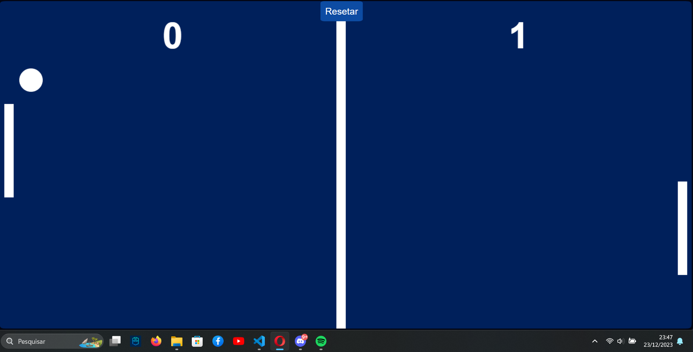

# Jogo de Ping Pong

Um simples jogo de Ping Pong implementado em HTML5, CSS3 e JavaScript.



## Sobre o Jogo

Este jogo de Ping Pong é uma versão clássica do jogo Pong, onde dois jogadores controlam as raquetes e tentam acertar a bola para marcar pontos. O jogo continua até que um dos jogadores alcance uma pontuação específica ou até que o botão de reset seja clicado.

## Como Jogar

- **Controles do Jogador 1 (Esquerda):**
    - Mover para cima: Mouse
    - Mover para baixo: Mouse

- **Controles do Jogador 2 (Direita):**
    - É feito através de um código (Fique à vontade para modificar!)

- **Resetar Jogo:**
    - Botão "Resetar" no canto superior

## Como Executar

1. Faça o clone deste repositório:

    ```bash
    git clone https://github.com/seu-usuario/jogo-pingpong.git
    ```

2. Abra o arquivo `index.html` em seu navegador.

## Licença

Este projeto está licenciado sob a Licença MIT - consulte o arquivo [LICENSE](LICENSE) para obter detalhes.

## Contribuições

Contribuições são bem-vindas! Sinta-se à vontade para abrir problemas (issues) e enviar pull requests para melhorias.

## Autor

Caio Anderson Martins Moura

---

**Divirta-se jogando Ping Pong!** 🏓
